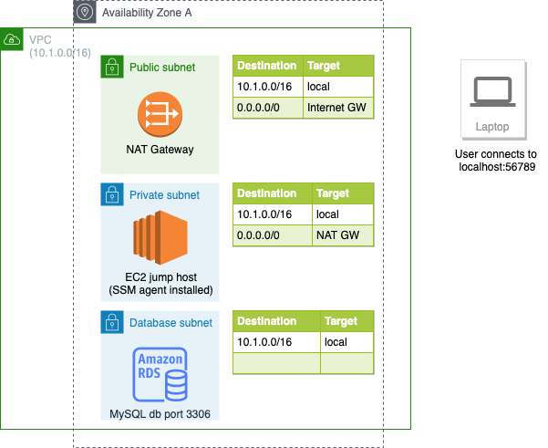

## AWS System Manager (SSM) Session Manager
AWS Systems Manager Session Manager allows you to securely connect to your EC2 instances, without the need to put them into public subnets and exposing any inbound ports to the internet. When Systems Manager‘s Agent is installed on your instances and when you have IAM permissions to call Systems Manager API, you can use the AWS Management Console or the AWS Command Line Interface (CLI) to securely connect to your Linux or Windows EC2 instances.

## Session Manager Port Forwarding
Port Forwarding allows you to forward traffic between your laptop to open ports on your EC2 instances with SSM agent installed. Once port forwarding is configured, you can connect to the localhost port of your laptop and access the server application running inside the EC2 instance. Systems Manager Session Manager’s Port Forwarding use is controlled through IAM policies on API access and the Port Forwarding SSM Document. These are two different places where you can control who in your organisation is authorised to create tunnels. To setup port forwarding on a laptop, simply run:
```
aws ssm start-session \
    --target instance-id \
    --document-name AWS-StartPortForwardingSession \
    --parameters '{"portNumber":["80"], "localPortNumber":["56789"]}'
```
Then you can access localhost:56789, which will connect to the EC2 instance port 80.
> Port forwarding feature on Session Manager is generally available since August, 2019, for detail please refer to this AWS [blog post](https://aws.amazon.com/blogs/aws/new-port-forwarding-using-aws-system-manager-sessions-manager/).

## Session Manager Port Forwarding to Remote Host
[Announced on May 27, 2022](https://aws.amazon.com/about-aws/whats-new/2022/05/aws-systems-manager-support-port-forwarding-remote-hosts-using-session-manager/), Session Manager supports forwarding connections from a client machine / laptop to ports on remote hosts. With remote port forwarding, you can now use a managed instance as a “jump host” to securely connect to an application port on remote servers, such as databases and web servers, without exposing those servers to public network and without the need of client VPN. For example in the following diagram:


- After port forwarding to RDS MySQL host is setup, when you connect to localhost:56789 on your laptop, you are actually connected to the RDS MySQL database port 3306.
- The RDS database is sitting in a private subnet without any public IP and there is only local route in the subnet's route table.
- The EC2 "jump host" is sitting in another private subnet with a default route to NAT gateway, this is to ensure the EC2 can connect to the SSM endpoints outside the VPC.
- In this setup, both the EC2 jump host or the RDS database instance is not exposed to the internet, the user in the laptop need to have corresponding IAM permissions to use session manager and setup port forwarding with the jump host, **by using this mechanism the laptop user can access private resources in VPC without the use of client VPN**.

## Step by step guide to setup port forwarding to remote host
1. Setup a EC2 jump host, either in a public subnet or in private subnet, if you want to setup it in a private subnet please setup NAT gateway or interface VPC endpoint for system manager, the jump host must have outbound network access to the SSM endpoints outside VPC.
2. Notice that there is NO NEED to allow any inbound ports in the jump host's security group. The jump host connect to the SSM endpoints, and your client laptop also connect to the SSM endpoints, and then your laptop and jump host can communicate.
3. Ensure your jump host installed with latest SSM agent, for port forwarding to remote host to work, the SSM agent version must be >= 3, please refer to [here](https://docs.aws.amazon.com/systems-manager/latest/userguide/ssm-agent-v3.html) for detail.
4. In your client laptop, ensure you have AWS CLI installed and with [Session Manager plugin](https://docs.aws.amazon.com/systems-manager/latest/userguide/session-manager-working-with-install-plugin.html) installed.
5. In your client laptop, run the following command to setup port forwarding to remote host, **the remote host can be any host/port that your EC2 jump host can connect to**, in this example it is RDS MySQL database port 3306:
```
aws ssm start-session \
    --target ec2-jump-host-instance-id \
    --document-name AWS-StartPortForwardingSessionToRemoteHost \
    --parameters '{"host":["mydb.example.ap-east-1.rds.amazonaws.com"],"portNumber":["3306"], "localPortNumber":["56789"]}'
```
6. Now you can connect to localhost:56789 using a MySQL client on your laptop, which will connect to the RDS MySQL database in private subnet.
